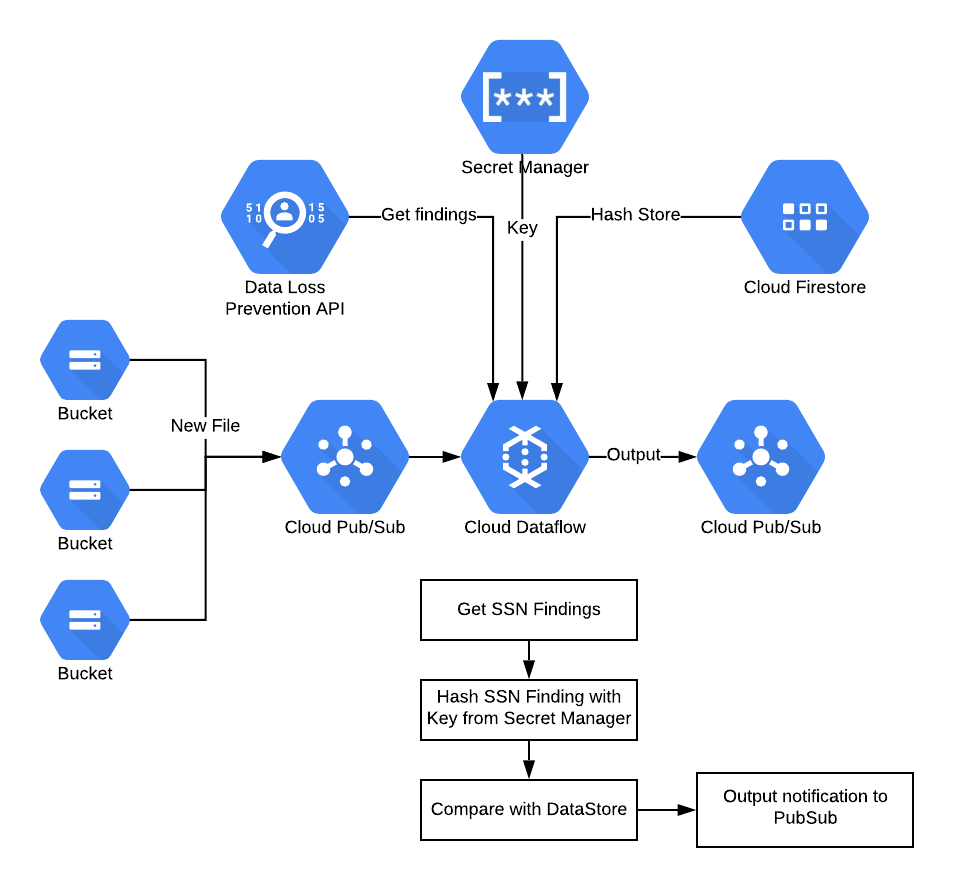

# Hashpipeline

## Overview

In this solution, we are trying to create a way to indicate security teams if there is a file found with US
Social Security Numbers (SSNs). While the DLP API in GCP offers the ability to look for SSNs, it may not be
accurate, especially if there are other items such as account numbers that look similar. One solution would
be to store SSNs in a Dictionary InfoType in Cloud DLP, however that has the following limitations:

* Only 5 Million total records
* SSNs stored in plain text

To avoid those limitations, we built a PoC Dataflow pipeline that will run for every new file
in a specified GCS bucket and determine how many (if any) SSNs are found, triggering a Pubsub Topic. The known
SSNs will be stored in Firestore, a highly scalable key value store, only after being hashed with a salt and
key, which is stored in Secret Manager. This is what the architecuture will look like when we're done.



## Usage

This repo offers end-to-end deployment of the hashpipeline solution using [HashiCorp Terraform](https://terraform.io)
given a project id.

### Prerequisites

This has only been tested on Mac OSX but will likely work on Linux as well.

* `terraform` executable is available in `$PATH`
* `gcloud` is installed and up to date
* `python` is version 3.5 or higher


### Step 1: Deploy the Infrastructure
Note that the following APIs will be enabled on your project by Terraform:

* `cloudfunctions.googleapis.com`
* `iam.googleapis.com`
* `dlp.googleapis.com`
* `secretmanager.googleapis.com`
* `firestore.googleapis.com`
* `dataflow.googleapis.com`
* `compute.googleapis.com`

Then deploy the infrastructure to your project

```
cd infrastructure
cp terraform.tfvars.sample terraform.tfvars
# Update with your own values.
terraform apply
```

### Step 2: Generate the Hash Key

This will create a new 64 byte key for use with HMAC and store it in Secret Manager

```
make pip
make create_key
```

### Step 3: Seed Firestore with SSNs

Since SSNs can exist in the data center in many stores, we'll assume the input is
a flat, newline separated file including valid SSNs. How you get them in that format is
up to you. Once you have your input file, simply authenticate to `gcloud` and then run:

```
./scripts/hasher.py upload \
		--project $PROJECT \
		--secret $SECRET \
		--salt $SALT \
		--collection $COLLECTION \
		--infile $SSN_FILE
```

For more information on the input parameters, just run `./bin/hasher.py --help`

### Step 4: Build and Deploy

This uses Dataflow's Templates to build our pipeline and then run it. To use the values we created in terraform, just run:

```
make build
make deploy
```

At this point your Dataflow job will start up, so you can check its progress in the GCP Console.

### Step 5: Subscribe

This pipeline just emits every finding in the file as a separate Pubsub message. We show an
example of how to subscribe to this and consume these messages in Python in the [poller.py](./scripts/poller.py)
script. However since this is specifically a security solution, you will likely want to consume
these notifications in your SIEM such as Splunk, etc.

## Testing/Demo

### Step 1

Follow Step 1 and 2 from above to setup the demo environment

### Step 2: Seed the Firestore with Fake SSNs

This script will do the following:

* Create a list of valid and random Social Security Numbers
* Store the plain text in `scripts/socials.txt`
* Hash the numbers (normalized without dashes) using HMAC-SHA256 and the key from step 2
* Store the hashed values in Firestore under the collection specified in the terraform variable: `firestore_collection`

```
make seed_firestore
```

### Step 3: Generate some input files for dataflow to use

This will store the input files under the `inputs/` directory, so we have something to test with.

```
make generate_input_files
```

### Step 5: Test out the pipeline locally

This will run the pipeline against the `small-input.txt` file generated by the previous step. In only has
50 lines so it shouldn't take too long.

```
make run_local
```


### Step 6: Subscribe
In a separate terminal, start the poller from the test subscription and count the findings by filename.
```
$ make subscribe
Successfully subscribed to <subscription>. Messages will print below...
```

Now in a third termnial, run the following command to upload a file to the test bucket.

```
export BUCKET=<dataflow-test-bucket>
gsutil cp inputs/small-input.txt gs://$BUCKET/small.txt
```

After a little while, in your `subscribe` terminal, you should get something that looks like this, after
the files have been uploaded, along with the raw messages printed to standard out:

```
...
-----------------------------------  --------
Filename                             Findings
gs://<dataflow-test-bucket>/small.txt  26
-----------------------------------  --------
```

This number can be verified by looking in the file itself on the first line, which would say `expected_valid_socials = 26`
for this example.


### Step 7: Deploy the pipeline to a template, so our Cloud Function can run it

```
make build
make deploy
```

Now you can try out the same thing as Step 4 to verify it works.

## Disclaimer

While best efforts have been made to make this pipeline hardened from a security perspective, this is meant **only as
a demo and proof of concept** and should not be directly used in a production system without being fully vetted by security
teams and the people who will maintain the code in the organization.
