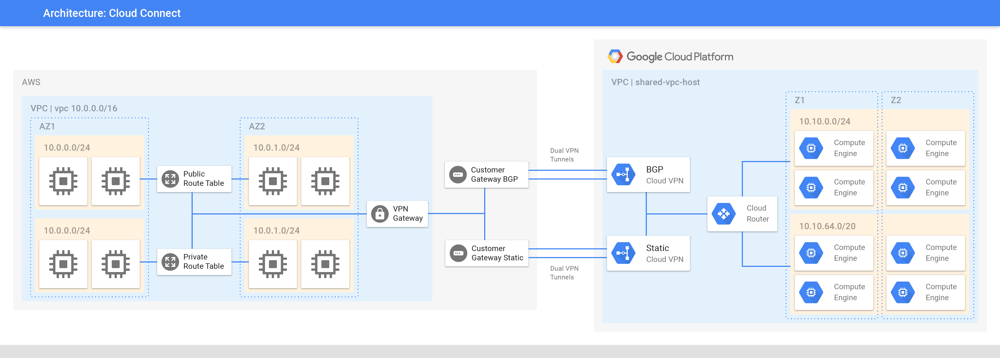
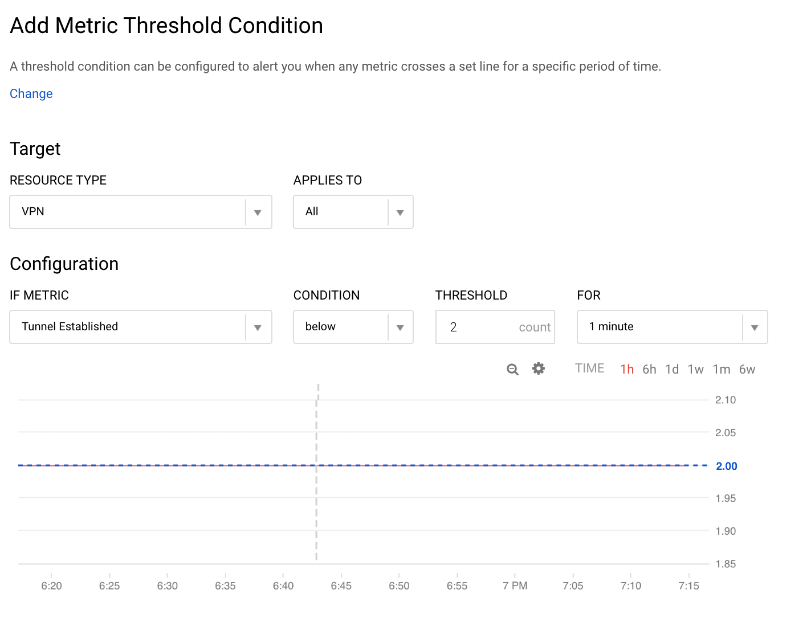
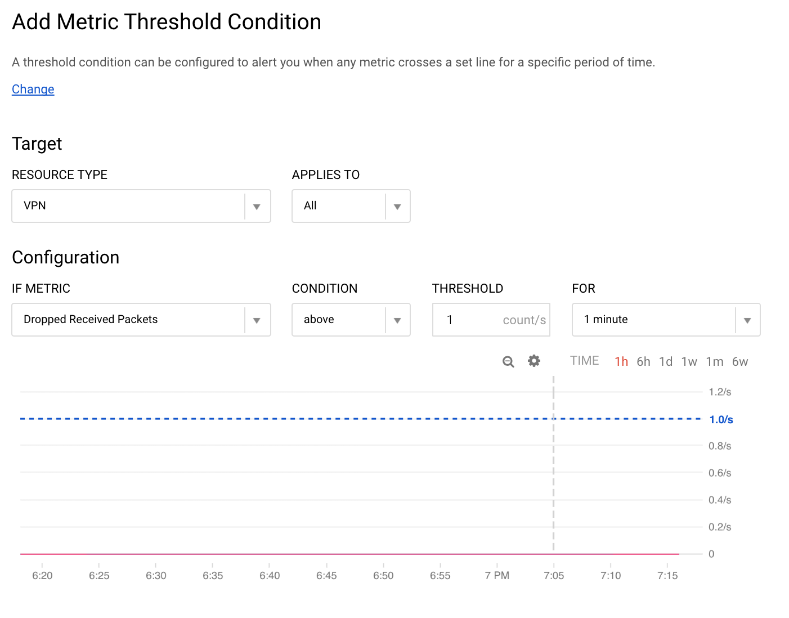
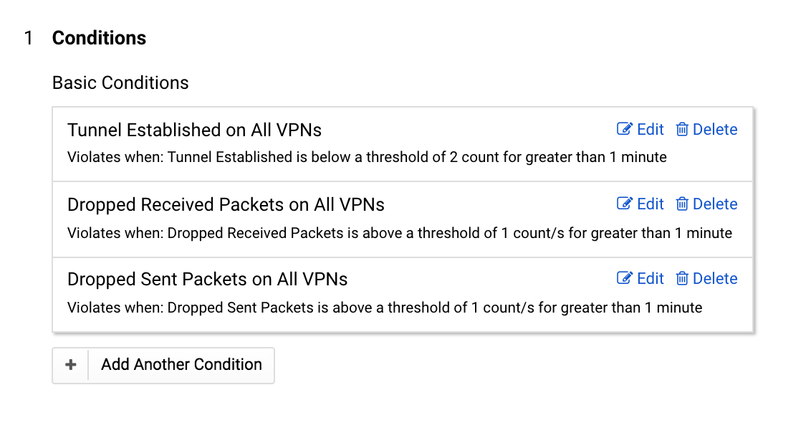
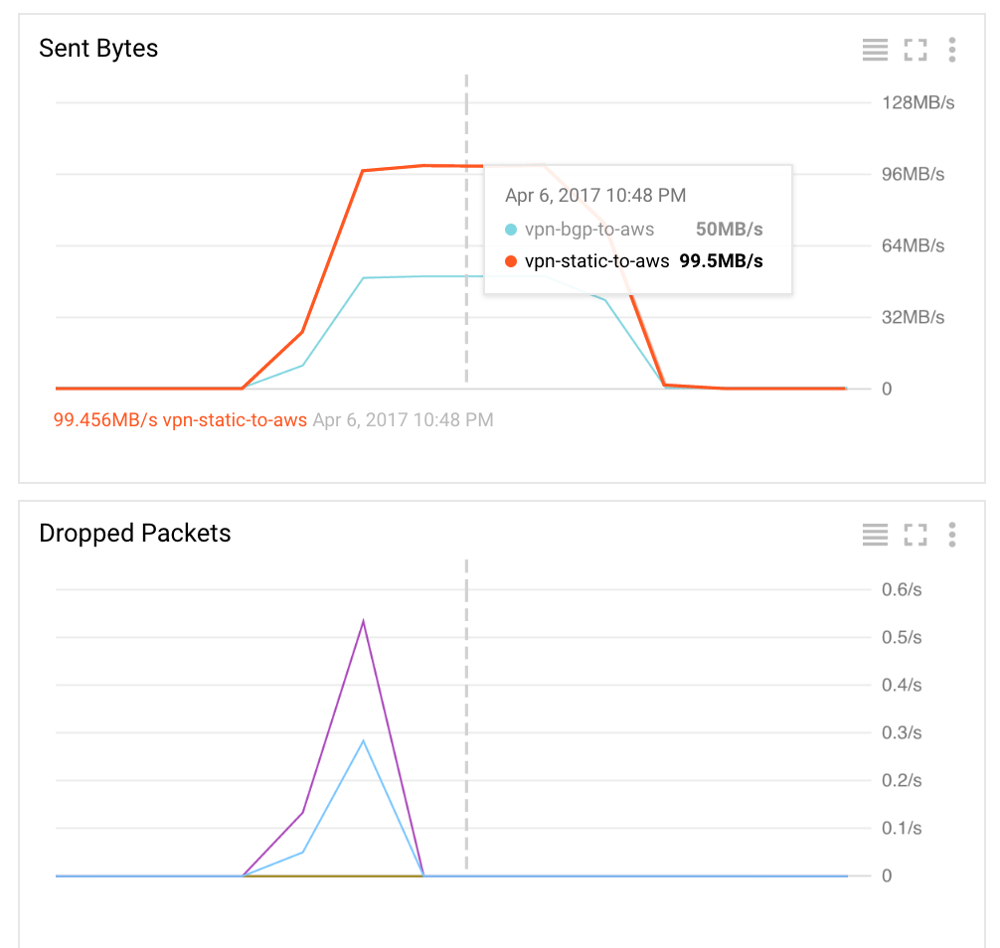
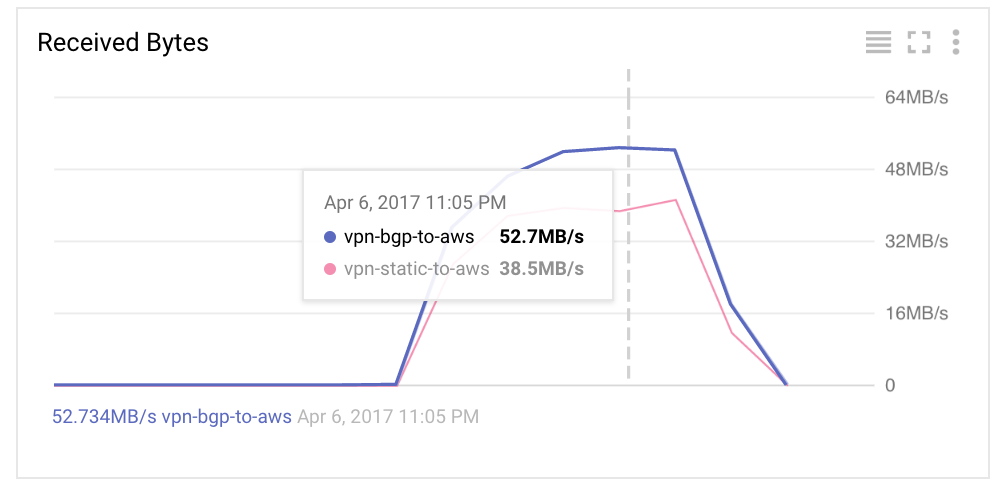

# CloudConnect - Establishing a VPN Connection Between AWS and GCP

CloudConnect is a package that automates the setup of dual VPN tunnels between AWS and GCP. While this connection is **NOT** meant for high throughput, low latency connections (1Gbps+), it can certainly support basic management and configuration traffic. Currently it supports the creation of both _static-routes_ and _bgp_ connections.

In [AWS](http://docs.aws.amazon.com/AmazonVPC/latest/UserGuide/VPC_Route_Tables.html#route-tables-priority), route priority is defined as:

- BGP propagated routes from an AWS Direct Connect connection
- Manually added static routes for a VPN connection
- BGP propagated routes from a VPN connection

In [GCP](https://cloud.google.com/compute/docs/reference/latest/routes), it's  defined by the route table and priorities:

- Routes match packets by destination IP address, preferring smaller or more specific ranges over larger ones.
- If there is a tie, the system selects the route with the smallest priority value.
- If there is still a tie, it uses the layer three and four packet headers to select just one of the remaining matching routes.

A common practice is to have a _bgp_ enabled connection for network to network connectivity, and then enable _static routes_ between more bandwidth hungry subnets.

## Prerequisites

This document assumes one has _compute.networkAdmin_ rights in the GCE VPC host project, and AWS Credentials to run CloudFormation that manages a VPC. For the static routes, must have the list of AWS and GCP subnet cidr blocks.

## Steps

This example establishes both _static_ and _bgp_ dual tunnel VPN connections. The static connection in this is between `10.10.0.0/24(GCP)` and `10.0.0.0/24(AWS)`. See figure below:

> Create Static IP addresses within the GCE VPC host project, in the region closest to the AWS VPC. These will be used as the PeerIp(s)  

**NOTE:** Run within the GCE VPC host project

    $ gcloud compute addresses create aws-vpn-static --description "VPN BGP Endpoint" --region us-east1
    address: 35.185.31.1
    ...
    $ gcloud compute addresses create aws-vpn-bgp --description "VPN BGP Endpoint" --region us-east1
    address: 104.196.135.13
    ...

> If a VPNGateway does not exist, use the CloudFormation template _aws-vpn-gateway.yaml_ to create and attach it to the VPC. One also controls the which Subnets see the VPN's propagated routes using the RouteTableIds parameter. In this example we want both public and private route tables to see GCP routes.  

    ## Get a list of VpcIds, and select VPC to connect to GCP.
    $ aws ec2 describe-vpcs
    ...

    ## Get a list of associated RouteTables  
    $ aws ec2 describe-route-tables --filters Name=vpc-id,Values=vpc-ffdd6a99

    ## Get a list of associated RouteTableIds and their associated Name tags
    $ aws ec2 describe-route-tables --filters Name=vpc-id,Values=vpc-ffdd6a99 --query 'RouteTables[].[RouteTableId,Tags[?Key==`Name`].Value]'

    ## In this example, we want to propagated VPN routes to the custom (private/public) tables
    $ aws cloudformation create-stack --stack-name vpn-gw --template-body file://aws-vpn-gateway.yaml --parameters ParameterKey=VpcId,ParameterValue=vpc-ffdd6a99 ParameterKey=RouteTableIds,ParameterValue="rtb-bbfe17c2\,rtb-4d1b8a34"

    ## Upon CREATE_COMPLETE, get the VPNGatewayId
    $ aws cloudformation describe-stacks --stack-name vpn-gw --query 'Stacks[0].Outputs[?OutputKey==`VPNGatewayId`].OutputValue' --output text
    vgw-919078f8

> Use the CloudFormation template _aws-vpn.yaml_ to create a CustomerGateway and enable the VPN connections. Both static and bgp configurations require the VPNGatewayId and PeerIp. For Static Routes, one is required to set StaticRoutesOnly to true, and the StaticRoute to the remote network cidr block. If multiple GCP static routes are required, go ahead and edit the template, using Route0 as an example.

    ## List GCE Vpcs
    $ gcloud compute networks list --uri
    https://www.googleapis.com/compute/v1/projects/shared-vpc-host/global/networks/vpc

    ## List GCE Subnets
    $ gcloud compute networks subnets list
    mgmt                   us-east1              shared-vpc-host      10.10.0.0/24
    services               us-east1              shared-vpc-host      10.10.64.0/20
    ...

    ## Static Route Example (10.10.0.0/24 is the GCP subnet)
    $ aws cloudformation create-stack --stack-name gcp-vpn-static --template-body file://aws-vpn.yaml --parameters ParameterKey=StaticRoutesOnly,ParameterValue=true ParameterKey=VPNGatewayId,ParameterValue=vgw-919078f8 ParameterKey=PeerIp,ParameterValue=35.185.31.1 ParameterKey=StaticRoute,ParameterValue="10.10.0.0/24"

    ## Upon CREATE_COMPLETE, get the VpnId
    $ aws cloudformation describe-stacks --stack-name gcp-vpn-static --query 'Stacks[0].Outputs[?OutputKey==`VpnId`].OutputValue' --output text
    vpn-914251f0

    ## BGP Example
    $ aws cloudformation create-stack --stack-name gcp-vpn-bgp --template-body file://aws-vpn.yaml --parameters ParameterKey=VPNGatewayId,ParameterValue=vgw-919078f8 ParameterKey=PeerIp,ParameterValue=104.196.135.13

    ## Upon CREATE_COMPLETE, get the VpnId
    $ aws cloudformation describe-stacks --stack-name gcp-vpn-bgp --query 'Stacks[0].Outputs[?OutputKey==`VpnId`].OutputValue' --output text
    vpn-8e4251ef

> Once the gcp-vpn* stacks are _COMPLETE_, pipe the CustomerGateway(XML) configuration into the `gcp-vpn-buildconf.py` command (Note: Requires python mod jinja2). This will output a yaml configuration file for the gcp-vpn.jinja DeploymentManager template. A Google network url, in the same project as the PeerIp created above is required. See `./gcp-vpn-buildconf.py -h` for more information. For static routes, both local and remote traffic selector options are required. Local being the GCP subnet cidr block(s), and remote being the AWS VPC subnet cidr block(s).

    ## Install Deps
    $ pip install jinja2

    ## Static Route Example (Use static route vpn gateway)
    $ aws ec2 describe-vpn-connections --filter Name=vpn-connection-id,Values=vpn-914251f0 --query VpnConnections[0].CustomerGatewayConfiguration --output text | ./gcp-vpn-buildconf.py --network https://www.googleapis.com/compute/v1/projects/shared-vpc-host/global/networks/vpc --local-traffic-selector 10.10.0.0/24 --remote-traffic-selector 10.0.0.0/24 > config.static.yaml

    ## BGP Example (Use bgp vpn gateway)
    $ aws ec2 describe-vpn-connections --filter Name=vpn-connection-id,Values=vpn-8e4251ef --query VpnConnections[0].CustomerGatewayConfiguration --output text | ./gcp-vpn-buildconf.py --network https://www.googleapis.com/compute/v1/projects/shared-vpc-host/global/networks/vpc > config.bgp.yaml

> Launch _gcp-vpn.jinja_ deployment

**NOTE:** Run within the GCE VPC host project

    ## Static Route Example
    $ gcloud deployment-manager deployments create vpn-static-to-aws --config config.static.yaml
    NAME                              TYPE                         STATE      ERRORS  INTENT
    vpn-static-to-aws                 compute.v1.targetVpnGateway  COMPLETED  []
    vpn-static-to-aws-rule-esp        compute.v1.forwardingRule    COMPLETED  []
    vpn-static-to-aws-rule-udp4500    compute.v1.forwardingRule    COMPLETED  []
    vpn-static-to-aws-rule-udp500     compute.v1.forwardingRule    COMPLETED  []
    vpn-static-to-aws-tunnel1         compute.v1.vpnTunnel         COMPLETED  []
    vpn-static-to-aws-tunnel1-route1  compute.v1.route             COMPLETED  []
    vpn-static-to-aws-tunnel2         compute.v1.vpnTunnel         COMPLETED  []
    vpn-static-to-aws-tunnel2-route1  compute.v1.route             COMPLETED  []

    ## BGP Example
    $ gcloud deployment-manager deployments create vpn-bgp-to-aws --config config.bgp.yaml
    NAME                         TYPE                         STATE      ERRORS  INTENT
    vpn-bgp-to-aws               compute.v1.targetVpnGateway  COMPLETED  []
    vpn-bgp-to-aws-router        compute.v1.router            COMPLETED  []
    vpn-bgp-to-aws-patch-router  gcp-types/compute-v1:compute.routers.patch  COMPLETED  []
    vpn-bgp-to-aws-rule-esp      compute.v1.forwardingRule    COMPLETED  []
    vpn-bgp-to-aws-rule-udp4500  compute.v1.forwardingRule    COMPLETED  []
    vpn-bgp-to-aws-rule-udp500   compute.v1.forwardingRule    COMPLETED  []
    vpn-bgp-to-aws-tunnel1       compute.v1.vpnTunnel         COMPLETED  []
    vpn-bgp-to-aws-tunnel2       compute.v1.vpnTunnel         COMPLETED  []

## Monitoring and Alerting with StackDriver

By default, StackDriver provides VPN metrics. From the Console, select _StackDriver -> Monitoring_, which redirects to StackDriver site. Under resources, select _GCP->VPN_ to display the VPN landing page.

Here one can determine the health of the tunnels, along with important performance characteristics. Following the figures below, one can create an array of standard conditions and apply it to a VPN Alerting Policy.

  **NOTE:** One can only rename Conditions after creation

## Testing

One can query the AWS VPN Gateway to provide status of the tunnels. In both cases, status should be _UP_, with the BGP connection reading _XX BGP ROUTER_ (meaning BGP has propagated the routes properly)

    ## Static Route
    $ aws ec2 describe-vpn-connections --filter Name=vpn-connection-id,Values=vpn-914251f0 --query VpnConnections[0].VgwTelemetry
    [
        {
            "Status": "UP",
            "AcceptedRouteCount": 1,
            "OutsideIpAddress": "52.4.54.162",
            "LastStatusChange": "2017-03-14T03:45:03.000Z",
            "StatusMessage": ""
        },
        {
            "Status": "UP",
            "AcceptedRouteCount": 1,
            "OutsideIpAddress": "54.173.28.19",
            "LastStatusChange": "2017-03-14T03:45:44.000Z",
            "StatusMessage": ""
        }
    ]

    ## BGP
    $ aws ec2 describe-vpn-connections --filter Name=vpn-connection-id,Values=vpn-8e4251ef --query VpnConnections[0].VgwTelemetry
    [
        {
            "Status": "UP",
            "AcceptedRouteCount": 22,
            "OutsideIpAddress": "34.193.213.250",
            "LastStatusChange": "2017-03-14T03:53:39.000Z",
            "StatusMessage": "22 BGP ROUTES"
        },
        {
            "Status": "UP",
            "AcceptedRouteCount": 22,
            "OutsideIpAddress": "34.193.235.205",
            "LastStatusChange": "2017-03-14T03:55:10.000Z",
            "StatusMessage": "22 BGP ROUTES"
        }
    ]

### Iperf

Performance with Iperf: In this example, 3 instances are launched in GCP and 3 in AWS. Four of the instances (2 in each environment) should live in subnets supported by the static route connection, and the last pair is intended to test the BGP connection.  

#### GCP -> AWS

  **NOTE:** Try running all client commands at the same time

- On each AWS instance, run `iperf3 -i1 -s`
- On each GCP instance, run `iperf3 -P2 -c <aws_internal_ip> -t300`
- Upon completion, reference StackDriver Sent Bytes and Dropped Packets

#### AWS -> GCP

- On each GCP instance, run `iperf3 -i1 -s`
- On each AWS instance, run `iperf3 -P2 -c <gcp_internal_ip> -t300`
- Upon completion, reference StackDriver Received Bytes and Dropped Packets

#### Failover Testing

This test will be run on two nodes within the static route supported subnets.

- On the one of the AWS, ping a corresponding GCP instance
- Using gcloud, kill the static vpn deployments `gcloud deployment-manager deployments delete vpn-static-to-aws`
- Verify that one gets an alert (if configured above), and ping reestablishes automatically within 1 minute.

## Deletion

> The following commands can be used to delete all stacks and templates created above

    ## Delete Static Deployment
    $ gcloud deployment-manager deployments delete vpn-static-to-aws

    ## Delete BGP Deployment
    $ gcloud deployment-manager deployments delete vpn-bgp-to-aws

    ## Delete BGP Stack
    $ aws cloudformation delete-stack --stack-name gcp-vpn-bgp

    ## Delete Static Stack
    $ aws cloudformation delete-stack --stack-name gcp-vpn-static

    ## Upon BGP and Static Stack Deletion, delete the VPN gateway
    $ aws cloudformation delete-stack --stack-name vpn-gw
